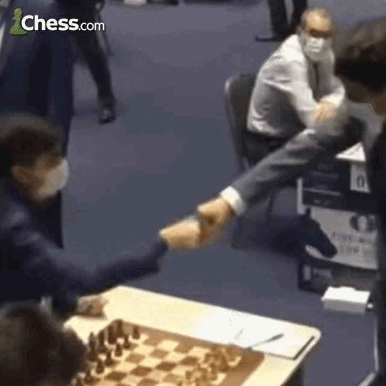

Ultrathink update for May 17th 0205 hours

(I lost access to my old Github acc so made a new one)

Hello, I'm Ankita, an ML Engineer who can't quit chess (trust me, i've tried)

Chesswrap fork for creating human like chess bots in progress [here](https://github.com/0xafraidoftime/chesswrap), prototype [here](https://0xafraidoftime.github.io/popsicle-bot-lab/)

If you're working on anything similar, feel free to say hi: ankitapal2499@gmail.com or go [here](https://discord.gg/vvfk4zzn) or [here](https://discord.gg/fsx46ZpE)

